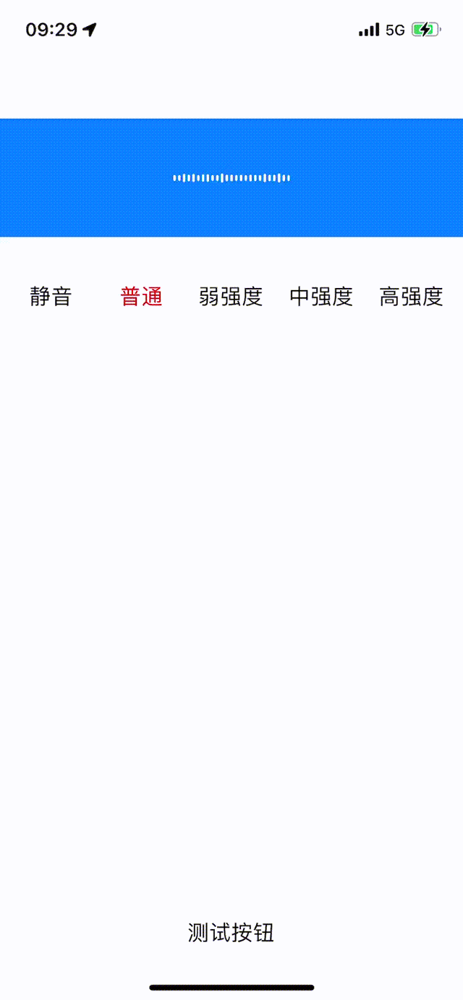

# 模仿微信语音发送动画效果

1. 根据声音大小，切换动画效果
2. 监听多个组件之间手势触摸和滑动

```objective-c
typedef NS_ENUM(NSInteger, SoundWavesLevel) {
    /// 静音
    SoundWavesLevelMute = 0,
    /// 默认状态
    SoundWavesLevelNormal = 1,
    /// 弱
    SoundWavesLevelWeak = 2,
    /// 中
    SoundWavesLevelMedium = 3,
    /// 强
    SoundWavesLevelStrong = 4,
};
```



